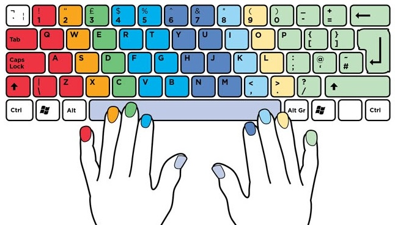

Typing
======

All the theoretical knowledge to learn typing is to know which finger goes to
each key. The rest is training and dicipline to keep the right finger over the
right key.

## traning

* [typing-cat](http://thetypingcat.com) - seems to be the best option.

* [keybr](https://www.keybr.com) - good exercises but without a clear
    methodology.

* [typing-club](https://www.typingclub.com) - this is a more formal course, with
    videos, etc... good for children.

